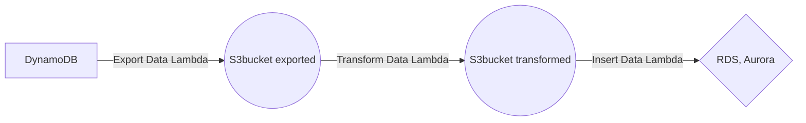

# Migration to Aurora and RDS

This is a project inside **kompetansekartlegging-app** which **migrates** the data from DynamoDB (graphQL) into a Aurora/RDS(postgress), through **aws lambda functions**. In short the migration is a three step process consisting of exporting the data, transforming it, and inserting into the Aurora cluster, as the following figure illustrates.

### Dependencies

Same as for the [kompetansekartlegging-app](https://github.com/knowit/kompetansekartlegging-app).

### How to run and deploy the migration

The migration is automatic run on the Migration stack's (CDK) first deployment. \
`$ cd kompetansekartlegging-app/cdk` \
`$ npm run deploy` \
However it will not automatic run on a later deployment. Consequently, one have to run the **export data lambda** in the **aws** console online (transformed and insert will then also be triggered to run). Read
[Known bugs/errors and possible improvements ](#known-bugs/errors-and-possible-improvements) section for suggestion on a possible alternativ solution.

### Aurora

The task was to migrate from DynamoDB to Aurora (Serverless). The Aurora database instance (or cluster) is defined in cdk/lib/aurora-stack.ts. There is a lambda function that creates tables in the database (if they don't exits already). The lambda function and the schema can be found in cdk/backend/functions/initDb. This function is initialized through cdk/hooks/hooks.ts that runs at the end of `$ npm run deploy`

Good to know:

- The table "group" and the table "user" **must** have double quotation marks around the name when used (_group_ and _user_ are reserved words in PostreSQL)
- The table "group" has a groupLeader which should be an existing user by logic - the connection is NOT made in the database yet because User also has a relation to the group (by id) - circular dependency. TODO: fix this relation in some way
- The Aurora Cluster is set up with PostgreSQL v10, an old version, this came from a desire to use the Query Editor in the AWS console (enables querying without downloading a lot of stuff on your machine). The Query Editor requires DataAPI to be enabled and DataAPI is only available on Aurora Serverless v1 - thus leading to an older version of PostgreSQL because of compatibilty with Serverless v1. The differences between Serverless v1 and v2 can be found here: https://docs.aws.amazon.com/AmazonRDS/latest/AuroraUserGuide/aurora-serverless-v2.upgrade.html#aurora-serverless-v2.move-from-serverless-v1
- The tables _do not_ have autogenerating of UUIDs because of the need to insert rows with old UUIDs from DynamoDB

### Export

Exporting data from Amazon DynamoDB tables to an Amazon S3 bucket.
Due to DynamoDB being rooted in NoSQL, empty values cannot be extracted through DynamoDB's scan-function. This project therefore goes through each unique key and fills in the empty values iteratively for the exportation to be successful.

### Transform

Transform delete and appends rows by using pandas.
If you want to delete more rows for a file modify the `removeColumns` argument in the transform function call.

Similarly, if you want to append a row with empty data, modify the `appendEmptyColumnsNames` argument in the transform function call.

Transform always removes the following rows : `__typename`, `orgAdmins` and `orgGroupLeaders`. To change these se the `dropColumns` list in the `dropColumns` function.

### Insert

Consist of runing **postgreSQL** insert statements into the aurora database. **aws** allows a maximum of 65536 characters in a insert statement, consequently we only insert 20 rows at a time.

Additionally, in some of the insert we remove rows which does not have their references, due to that deleting in dynamoDB is not cascade.

### Known bugs/errors and possible improvements

Known bugs:

- **Schema (FormDefintion)**: remove sortKeyConstant, requires change in the insert lambda, `formDefinitionSQL` function
- **Schema (UserForm)**: owner should refer to a user
- **Schema (Category, question, questionAnswer)**: missing createdAt and updatedAt, , requires change in the insert lambda, `categorySQL`, `questionSQL`, and `questionAnswerSQL` functions (The file contains these data `row.createdAt` and `row.updatedAt`)

Possible improvements:

- Create a script to run to start the migration
- Replace or improve the insert lambda with a firehose solution
